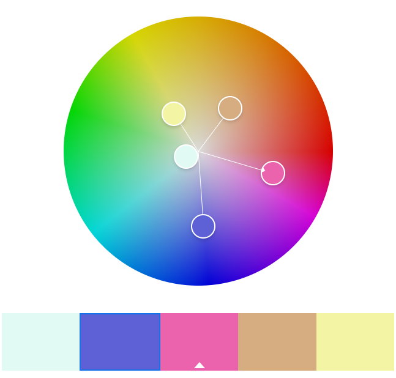

# Assignment 1

Jack Sullivan

This is my first project in CS 4241, and it shows that I can do a basic project combining HTML, CSS, and javascript.

## Technical Achievements

- CSS styling: I set rules for `html`, `body`, `h1`, `h2`, `p`, `li`, and `b`. I also defined the classes `.page` and `.centered` to organize my content and make the page more readable
- Javascript animation: I just made a ball bouncing back and forth within a canvas for this
- HTML tags: I used `
` and `` to organize some stuff
- Image: I put [dancing Thanos](https://c.tenor.com/L4DgAFBQTuoAAAAi/twerking-thanos.gif) into my page

## Design Achievements

I only made a color wheel, and I didn't use all the colors since I didn't want to be tacky.

## Random

I also tweaked the server slightly based on the suggestions you gave in class.
