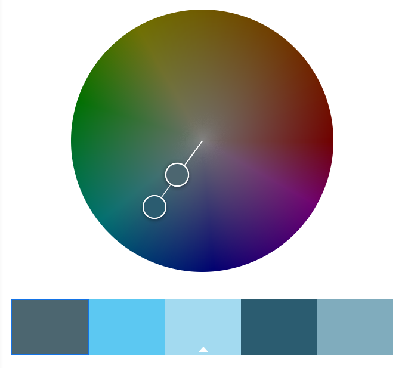

# A1 - Matthew Spofford

<https://a1-matthewpofford.glitch.me>

This project shows how to create a basic webpage using HTML/CSS/JavaScript. This involved creating a basic HTML layout, stylizing it with some basic CSS attributes, as well as creating some basic functions/animations with Javascript.

## Technical Achievements

- **Styled page with CSS**: Added rules for the following tags:

| Selectors | Rule Description |
| ----------| -----------------|
| body | Apply a linear gradient towards the top right of the page; create a margin on the page; define constants for applying colors more easily later. |
| h1 | Centers the header, applies  *Staatliches* font, applies font color, and increases font size; creates box border around header boundary. |
| h2 | Centers the header, applies  *Staatliches* font, applies font color, and increases font size; creates line from the bottom border. |
| h3 | Centers the header, applies  *Staatliches* font, applies font color, and increases font size; underlines text, and removes margin |
| p | Apply font color and "Segoe UI" font; set margin to auto, and create a fixed width so that the text is left aligned while still being centered to the page. |
| p.center | Centers the specific paragraph text. |
| div.img-group | Centers the *div* with the classification of *img-group*, as it is assumed to be centering a group of images. |
| div.img-group a | Creates padding between the images (or links) in the group, and removes text-decoration so that the underlining of the hyperlink is removed. |
| table | Apply font color and "Segoe UI" font; set margin to auto, and create a fixed width so that the table is centered; create a border for the table with a specific font color. |
| td.aLot | Applies *Staatliches* font, applies font color, and increases font size. This is so that the technologies I am familiar with "a lot" are clearly differentiated from on the table. |
| ul | Set margin to auto, and create a fixed width so that the list is left aligned while still being centered to the page. |
| li | Apply font color and "Segoe UI" font. |

- **Implemented constants for accessing color pallet**: Each of the colors that I created with my color wheel were saved in constants in my *body* CSS selector.

- **Created animation with JavaScript**: Created a JS animation so that when a user hovers over my personal social media hyperlinks/images, it "jiggles" the animations by rotating them a few degrees back and forth. When the user stops hovering over the images, it then stops the animation. More information can be found in the code within *index.js*. ***DISCLAIMER:*** The animation appears to be buggy on mobile (which I doubt this will be tested on). When a link is clicked on a mobile device, the *onmouseout* or *onmouseleave* events are never triggered, and so the animation is never terminated.

- **Used different HTML tags**: These extra tags are given further description for their use case below:

| HTML Tags | Description |
| --------- | ----------- |
| div | Was used to group my hyperlinks/images so that they could be more easily centered on the page. |
| a | Used to create a hyperlink to somewhere outside of the webpage (LinkedIn and GitHub). |
| table | Used to create my "technology familiarity" table. |
| tr | Used to create the "technology familiarity" table rows |
| th | Used to create the "technology familiarity" table headers. |
| td | Used to create the "technology familiarity" table data. |

- **Added support for external CSS/JS**: The server.js script now is capable of accessing the new index.css and index.js files when they are requested by the browser. The browser requests the file due to the CSS/JS file being mentioned correctly in index.html. This was a challenge, because I needed to actually decipher how the server.js file functions.

## Design Achievements

- **Created custom color pallet**: Pallet values can be found at the top of the CSS file. Based on this color wheel:

This was a challenge because it was difficult to find an appealing color pallet to use, as well as find what elements to apply it to.

- **Used font from Google fonts**: Used the [Staatliches](https://fonts.google.com/specimen/Staatliches?sort=popularity) font in my CSS file. This was a challenge, as I needed to find out how to access the font and add it to my style sheet, as well as how to then add the font to my selectors. I used a default OS font called "Segoe UI".