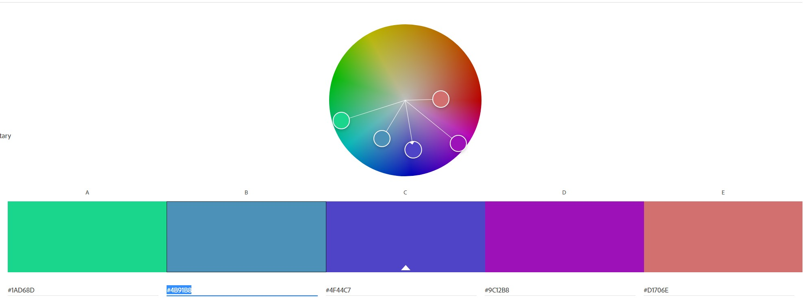

Adam Grabowski
https://a1-argrabowski.glitch.me/

This project shows my knowledge of web technologies such as HTML, CSS and other resources like Google Fonts and Adobe Color.

## Technical Achievements
**Styled Page with CSS**: Added rules for the following:
- body: Rule to control the background color was added.
- h1: Rules to control the color, font, and text decoration like underline were added.
- h2: Rules to control the color and font were added.
- p: Rules to control the color and font were added.
- li: Rules to control the color and font were added.
- table: Rules to control the color of text, font of text, and left margin were added.
- a:hover: Rule to control the highlight color when a link is hovered over.

**Experimented with HTML Tags**: Used the following additional tags:
- a: This tag was used twice as a link to Hannaford and Raytheon's websites.
- b: This tag was used to embolden certain text in paragraphs that denote lists or topics.
- img: This tag was used to include a picture of the WPI logo through a link to the image.
- ol: This tag was used to create an ordered list of the CS courses I have taken at WPI.
- table: This tag was used to create a table of some technologies and my experience with them.

## Design Achievements
**Used the Orbitron Font from Google Fonts**: I used Orbitron as the font for the text on my site.

**Used a Color Palette Created in Adobe Color**: I created a split complementary color palette for the text on my site shown below.

