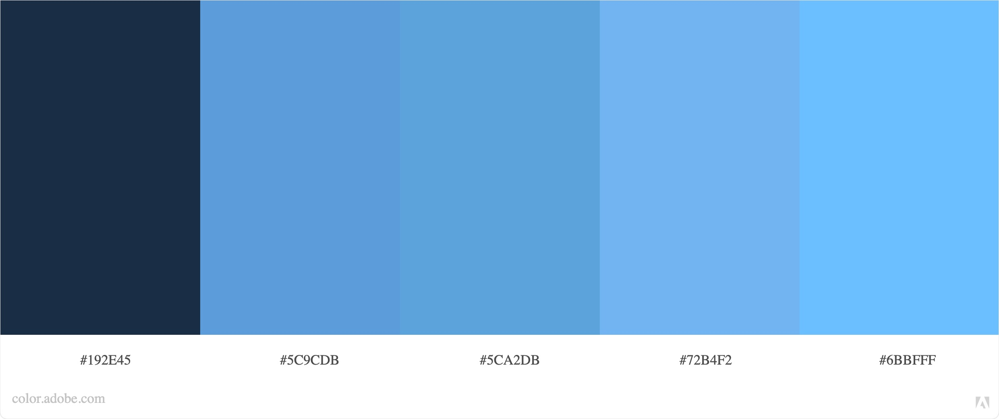

README
---

Harrison Kyriacou
http://a1-hmkyriacou.glitch.me

In this project I created a simple website that can act like a "portfolio" to show what experience and skills that I have. I used HTML and CSS to create the website and a node.js backend to host it.

## Technical Achievements
- **Styled page with CSS**: Added rules for the body, h1/h2, table/th/td/tr, header, link, and button selectors.
- **Using other HTML tags**: Other than the tags in the started code, I used the table/th/td/tr, header, button, ul/li, and link tags
- **Modified server code**: Modified server code to support an external CSS file 

### Design Achievements
- **Used a Adobe Color Palette**: I used the Blue Sky Moisty 2 color pallete from color.adobe.com. 
- **Used the Lora Font from Google Fonts**: I used Lora as the font for all text in my site.
