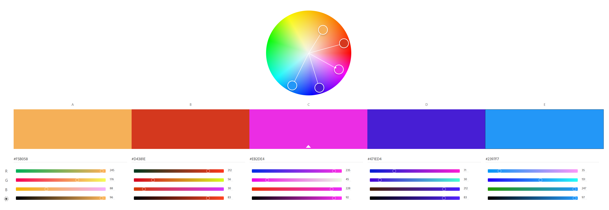

Assignment 1
---

Ke Zhao (KorbinZ3)
http://a1-korbinz3.glitch.me

This project shows my personal information.

## Technical Achievements
- I use CSS for this website. All propertoes are in the style tag.
- I use 6 HTML tags. one for background, 2 for image. one for email link, one for WPI website link, one for text area use.
- WPI image is shown beside the information, which can help visitor get better understanding.
- There have a hyperlink to WPI website, which can help visitor be more easiler to find WPI website.
- I create a area for visitor to write text to me, and also create a send button. However, the function is not been implemented.
- I also create a email link to directly send email to me, which will directly open the email app.

### Design Achievements
- I used Roboto as the font for the primary text in my site.
- I use 5 color from color.adobe.com. The screenshot is in the repo, they are #F5B058, #D4381E, #EB2DE4, #471ED4, #2397F7
 
- I add a gray background to make website more readable and eye-friendly.
