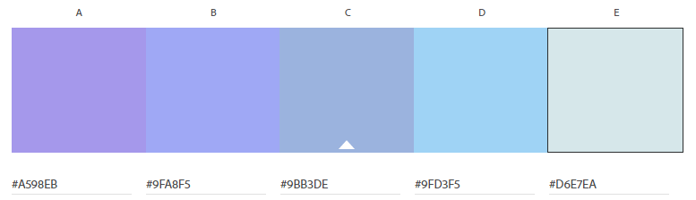

Readme
---

Errica Cheng

https://a1-lockeanddemosthenes.glitch.me

This project is effectively a warmup for the CS4241 Webware course at WPI. Several technical and design achievements were met in the process of creating this page.

## Technical Achievements
- **Styled page with CSS:** Added rules for the body, h1, h2, ul, and a selectors.
	- The body rules set the basis of the font family and size, as well as the background color of the page. It also sets the padding for the whole page.
	- The h1 rules set the h1 color, size, and adds a stroke to the words.
	- The h2 rules set the h2 color and size.
	- The ul rules set the bullet style and positioning.
	- The a rules set the color when the link is visited vs. when it is hovered over.
- **Other HTML Tags:** The additional HTML tag I used was the a tag.

## Design Achievements
- **Created and used a color palette in color.adobe.com:** I created an analogous color scheme, as seen below.

	- The h1 selector uses the first color, #A598EB.
	- The h2 selector uses the second color, #9FA8F5.
	- The a selector uses the third (#9BB3DE) and fourth (#9FD3F5) colors for hovering over and visited links, respectively.
	- The background color of the page is the fifth color, #D6E7EA.
