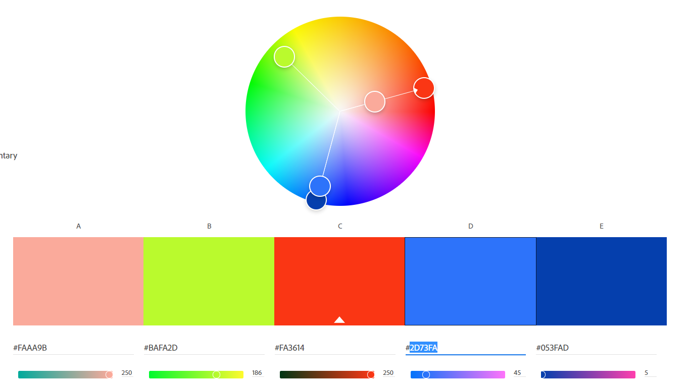

Mayank Govilla
http://a1-mgovilla.glitch.me

This project is a basic website build in html, css, and js

## Technical Achievements
- **Styled page with CSS**: Added rules for the body, p, and li selectors with colors and new Google Fonts.
- **Added HTML Tags**: Animation divs and extra information through links
- **JS Animation**: Basic JS/CSS animation to show purple rain 

### Design Achievements
- **Used Google Fonts**: I used Kaisei Tokumin as the font for the primary copy text in my site.
- **Very fun colors**: Looks like its a middle school project from the 90s 

