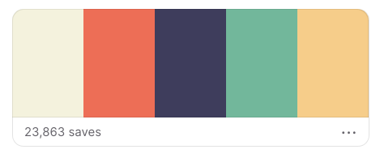

Assignment 1 - Hello World: Basic Deployment w/ Git, GitHub, Glitch
===

---

This assignment requires that your website is both contained in a GitHub repository and hosted in Glitch. There are two ways to do this:

1. Fork this repo and clone it to your computer, make changes locally on your computer, push the repo onto GitHub, and then import your GitHub repo into Glitch.
2. Fork this repo and then import it directly to Glitch, use the Glitch editor to make changes, and then export your repo from Glitch back to GitHub.
3. Same as #1, but instead of importing from Github to Glitch you just upload the files (or copy/paste) them directly to Glitch.

## Option 1 - Clone to computer, push to Github, import to Glitch (recommended)

1. Fork the starting project code in GitHub. This repo contains:
    * the server code, `server.js`
    * A starting `index.html` file that you will edit as described below
    * A package.json file that helps configure Glitch
    * This README
2. Edit `index.html` to show the following information about you:
    * your name and class at WPI (e.g. class of 2020) Note: Do not put any contact or personal information that you do not potentially want other people outside of this class to see.
    * your major(s) and minor(s)
    * previous computer science courses that you have taken at WPI
    * your experience with the following technologies and methods (none, some, a lot)
        * HTML
        * CSS
        * Java
        * JavaScript
        * Ruby
        * Python
        * unit testing
4. Complete some technical and/or design achievements (see below).
5. Test your project to make sure that when someone goes to your main page, it displays correctly. You can do this locally by simply running `node server.js` from within the assignment directory.

6. Modify the README file according to the specification below.
7. Commit and push all your changes to GitHub. 
8. Deploy your project to Glitch. You can do this by [importing the repo from GitHub](https://medium.com/glitch/import-code-from-anywhere-83fb60ea4875)
9. Ensure that your project has the proper naming scheme (guide follows) so we can find it.
9. Create and submit a Pull Request to the original repo.

Naming and URL Scheme
---

You must use a consistent naming scheme for all projects in this course.
If we can't find it, we can't grade it.

By default Glitch often assigns your application a random name. To change it, click on the project dropdown menu in the upper left corner of Glitch. You will then see an additional text field displaying the project name in the resulting menu; click here to edit the name.

The name scheme should be `a1-yourGitHubUsername`.
The `a1` will need to be updated to `a2`, `a3`, and so on in future projects.

Jyalu Wu
http://a1-charlieroberts.glitch.me

Achievements
---
### Technical Achievements
- **Created buttons and other pages**: Added 3 other pages (experience, projects, and cats) in addition to the main landing page
- **Put two divs side by side**: Put two divs (text and image) side by side on the landing page
- **Added a CSS stylesheet**: Used a CSS file to change the fonts,  margins/padding in all pages, and colors (background, font, buttons)
- **Numerous HTML tags**: Image, link, button, list item, headers
- **JS animation**: Some particle animations on the landing page

#### Design Achievements
- **Used the Lemon and Montserrat fonts from Google Fonts**: I imported these fonts and used them on the site
- **Nice color palette**: Picked a color palette from coolors.co

- **Cat image**: Added a cute cat pic!
- **Minimalistic layout**: Used a simple + minimalistic layout that is (hopefully) pleasing to the eye
- **Particles**: Nice particles on the landing page, same color palette
- **Custom favicon**: Custom favicon with my initials on it

Resources
===
- [Particles.js library](https://github.com/VincentGarreau/particles.js/)
- [Particles.js tutorial](https://redstapler.co/particles-js-tutorial/)