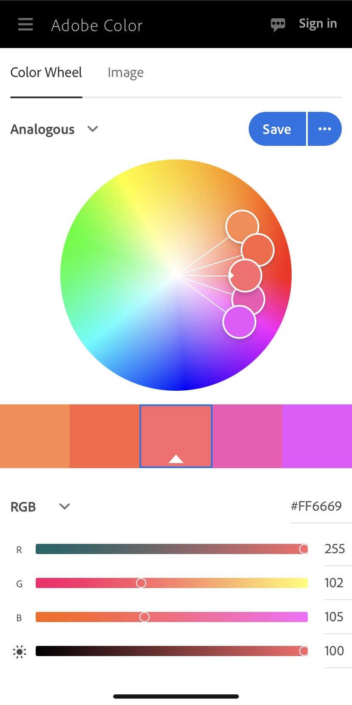

Michael Zeolla
https://a1-mjzeolla.glitch.me/

This project shows ...

## Technical Achievements
- **Styled page with CSS**: 
1. (max 5 points) Style your page using CSS. Each style rule you apply will get you 1 extra point for a maximum of 5 points. Be sure to describe your style rules in your README. (DONE)
    +1 Different Color of Header
    +1 Centered Objects
    +1 Table border for items
    +1 Changes font size
    +1 Changed font style

2. (5 points) Add a simple JavaScript animation to the page. (DONE)
    +5 Click the image at the top to rotate the image

3. (max 5 points) Experiment with other HTML tags (links, images, tables etc.) Each extra tag you use will get you 1 extra point for a maximum of 5 points. Be sure to describe the links you use in your README. (DONE)
    +1 Incorporates an Image of me
    +1 Incorporates links to social media
    +1 Table used for courses taken
    +1 Footer Included
    +1 Div used to seperate website

### Design Achievements
- **Used the Roboto Font from Google Fonts**: 
*Design*
1. (10 points) Create a color palette using [color.adobe.com](https://color.adobe.com). Use all the colors in the palette in your webpage by implementing the appropriate CSS. Add a small screenshot of the color wheel for your color palette to your repo. (DONE)
    +10 Colors are implemented throughout the webpage
    
    

2. (5 points) Use a font from [Goolge Fonts](https://fonts.google.com) in your website. (DONE)
    +5 Oswald is used in the font for the main header at the top of the webpage. 

