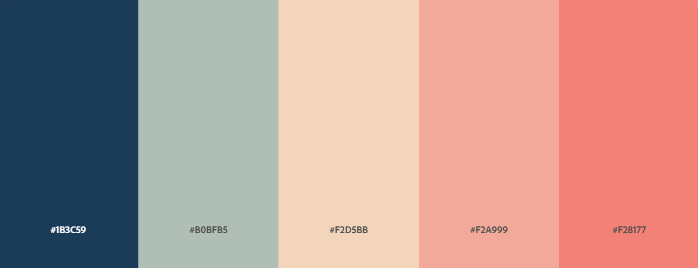

Assignment 1 - Hello World: Basic Deployment w/ Git, GitHub, Glitch
===

Evelyn Tran
http://a1-evelyntrvn.glitch.me

This project shows ...

## Technical Achievements
- **Responsive Layout**: The page layout is somewhat responsive to changing the window size, with the exception of the stars in the background. I got to experiment with float attribute as well as the @media rule
- **Added Twinkle Animation**: I used JS to create stars in the background and made them twinkle.
- **Added Fade In**: I used CSS to do a fade in for all the elements on the webpage
- **Hovering Over Links**: The links are highlighted when hovered over.
- **Added CSS Rules**: I added rules to the headers, text, img, and different divs to make the page more cohesive.

## Design Achievements
- **Created a Color Palette**: Used the following color palette for my website

- The dark blue is used in the background and as the body's text color
- The green is used in the subtitle
- The light tan is used for the stars and highlight color for the links
- The light pink is used for the title (my name)
- The dark pink is used for the other headers

- **Used the Roboto and Open Sans Font from Google Fonts**: I used Open Sans for most of the text on my website, with the exception of Roboto for the headers 

### References
- https://www.w3schools.com/html/html_responsive.asp
- https://jsfiddle.net/psullivan6/ma6e78m0/ 
- https://yossiabramov.com/blog/vanilla-js-starry-night