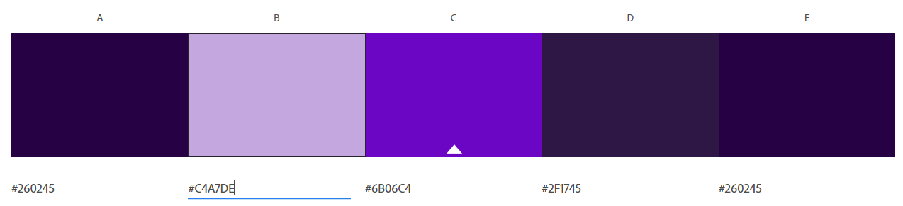

Matthew Malone
http://a1-matthew7758.glitch.me

This project shows a basic introduction page and an example of external CSS design, as well as several basic HTML tags.

## Technical Achievements
font-family. Added a custom font and applied it to the body tag. Overall the most challenging part was including the API and testing it thoroughly.

**Styled page with CSS**: Added external CSS page. 
1. text-align. Aligned the h1 tag to the center of the page. Experimented with different alignments before settling on center.
2. color. Changed color of text. Used this. Challenging to make all colors look nice.
3. margin. Adjusted margin of h2 tag to separate parts of webpage.
4. border. Added a purple border to the h1 tag.
5. height/width. Auto resize images for responsive web layouts.

**Extra HTML tags**:  Added extra HTML tags not originally in the index.html file.
1. a. Added a link at the bottom of the page.
2. img. Image. Added an image from another site since the server isn't configured to serve image files.
3. div. Added division containers around image to place it in a container.
4. br. Added line breaks.
5. strong. Made class of 2022 bold.

### Design Achievements
- **Used the Roboto Font from Google Fonts**: I used Roboto as the font for the primary copy text in my site.
- **Created Color Profile from color.adobe.com**: Created and used a color profile.
