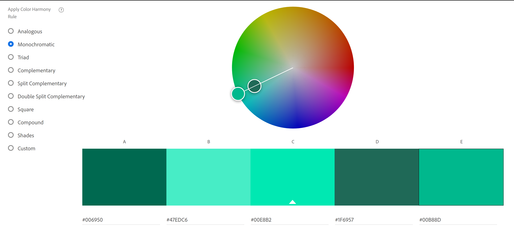

Name: Aditya Kumar

WPI email: akumar6@wpi.edu

Github Username: hellofellowkids

Glitch link: http://a1-hellofellowkids.glitch.me

Assignment 1 - Hello World: Basic Deployment w/ Git, GitHub, Glitch

*DUE: Monday, August 30th by 11:59 AM (before the start of class!)*  

## Technical Achievements
1. **Style your page using CSS**: In "styles.css" , added various attributes to style in elements. This includes:
- text-align
- border
- margin
- width
- padding
2. **Add a simple JavaScript animation to the page.** Simple animation launched when clicking "Click Me" on page. Hope you can enjoy!
3. **Experiment with other HTML tags** Added various tags including:
- div
- img
- table
- a (link)
- strong

## Desgin Achievemnets
1. **Create a color palette using color.adobe.com.**: Selected and used a color palette from the website. 

2. **Use a font from Goolge Fonts in your website**: Used the "Devonshire" Google Font for "h1" element.
